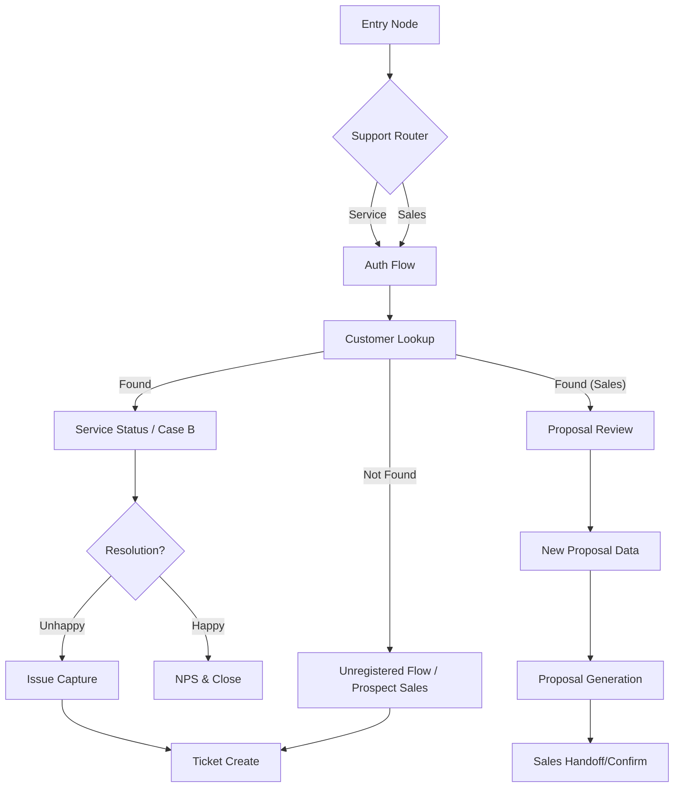

# SunBun Solar Assistant (Week 1)

A deterministic state-graph backend for a solar sales and service assistant, built with **LangGraph** and integrated with actual customer/site data.

## 🚀 Project Overview
SunBun is an intelligent Solar Sales & Service Assistant designed to provide seamless support for both existing customers and new prospects. By utilizing a deterministic state-graph architecture, the assistant ensures reliable, turn-based interactions compliant with the SunBun brand guidelines.

### Architecture & Approach
We utilized **LangGraph** to build a robust, circular, and modular state machine. Unlike standard LLM chatbots, our approach is **governed by deterministic nodes**, ensuring:
1. **Consistency**: Every user follows the same verified logic paths (Step 1-8).
2. **Reliability**: No LLM hallucinations in pricing, sizing, or technical diagnosis during Week 1.
3. **Traceability**: Every state transition is tracked via a typed `State` object.



## 📸 Screenshots


## 🎥 Video Walkthrough
[](https://example.com/sunbun-video)
*(Placeholder link: Replace with actual video demonstration URL)*

## 🛠 Features
- **Deterministic Routing**: Automated branching for Sales vs. Service support.
- **OTP Authentication**: Robust 3-turn loop with failover paths.
- **Service Case B Analysis**: Automated computation of cloudiness and production averages.
- **Sales Proposal Engine**: Deterministic sizing logic based on electricity bill and tier preferences.
- **Agent Protocol Compatibility**: Ready for integration with standards-based frontends.

## ⚙️ Setup & Execution
1. **Install Requirements**:
   ```bash
   pip install langgraph-cli pandas fastapi uvicorn
   ```
2. **Launch LangGraph API Server (for Agent Chat)**:
   ```bash
   python -m langgraph_cli dev
   ```
   *Note: This starts the server on `http://localhost:2024`.*

3. **Connect to Agent Chat UI**:
   - Open [agentchat.vercel.app](https://agentchat.vercel.app/) in your browser.
   - Enter `http://localhost:2024` as the **Deployment URL**.
   - Enter `agent` as the **Assistant / Graph ID**.
   - Click **Continue** to start interacting with SunBun!

4. **Run All Verifications (Internal)**:
   ```bash
   python run_all_tests.py
   ```

---
**SunBun Solar Assistant** - *Empowering sustainable energy through intelligent assistance.*
=======
